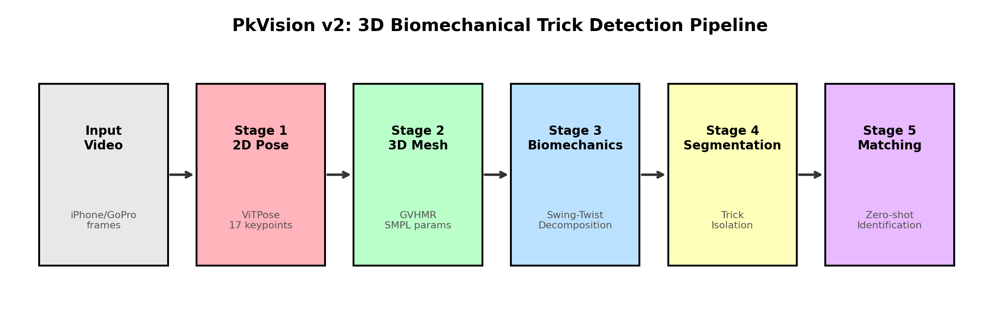
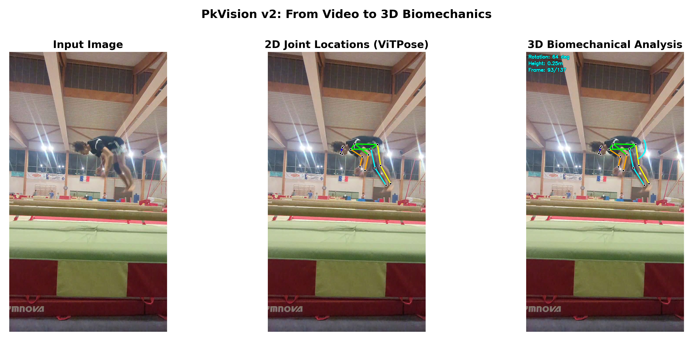
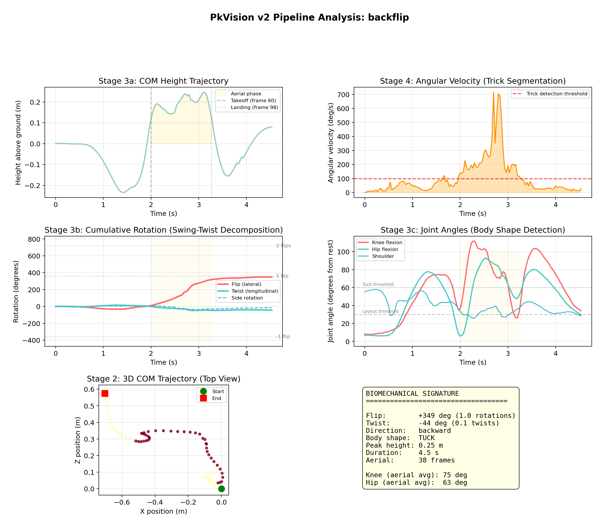

<p align="center">
  <strong>PkVision</strong><br>
  3D Biomechanical Parkour Trick Detection & Scoring
</p>

<p align="center">
  
  
  
  
</p>

---

## What is PkVision?

PkVision is an open-source system that identifies and scores parkour tricks from video using **3D body mesh reconstruction** and **zero-shot biomechanical matching**. It understands how the human body moves through 3D space — rotation axes, flip counts, twist counts, body shape, takeoff type — and matches these measurements against 1,800+ known parkour tricks without needing training videos for each one.

**The core idea:** A backflip is a 360° backward rotation around the lateral axis in a tucked position. If the system can measure those properties in 3D from video, it can name the trick — even tricks it has never seen before.

### Why 3D?

Previous approaches (including PkVision v1) used 2D pose estimation, which fundamentally cannot distinguish many tricks:
- A **cork** and a **back full** look identical from certain camera angles in 2D
- **Twists** are invisible when filmed from the side
- **Rotation counting** is imprecise from 2D projections

By reconstructing a full 3D body mesh from video, all ambiguity disappears. The rotation axis is a 3D vector, not a guess.

---

## Pipeline

<p align="center">
  
</p>

```
Video (smartphone, GoPro, competition camera)
  │
  ├─ Stage 1: 2D Pose Estimation (ViTPose — 17 COCO keypoints)
  │  Detects the athlete and tracks 17 body joints per frame.
  │
  ├─ Stage 2: 3D Mesh Recovery (GVHMR — SMPL body model)
  │  Reconstructs a full 3D body mesh in world coordinates,
  │  aligned with gravity. Outputs per-frame:
  │    • global_orient (3D) — body orientation as axis-angle
  │    • body_pose (63D) — 21 joint rotations
  │    • transl (3D) — world position in meters
  │
  ├─ Stage 3: Biomechanical Feature Extraction
  │  From the SMPL parameters, computes:
  │    • Swing-twist decomposition → flip degrees + twist degrees
  │    • Joint angles → body shape (tuck / pike / layout)
  │    • Ankle analysis → takeoff type (one-foot / two-foot)
  │    • COM trajectory → jump height, aerial phase detection
  │
  ├─ Stage 4: Trick Segmentation
  │  Detects where each trick starts and ends in a full run
  │  using 3D angular velocity peaks + aerial phase detection.
  │
  ├─ Stage 5: Zero-Shot Trick Matching
  │  Compares the 3D biomechanical signature against 1,800+
  │  trick definitions. No training videos needed per trick.
  │
  └─ Stage 6: Scoring (Top 3 by difficulty × confidence)
```

### Key Results

<p align="center">
  
  <br>
  <em>Left: Input frame. Center: 2D joint locations (ViTPose). Right: 3D biomechanical analysis overlay.</em>
</p>

| Clip | Measured Flip | Measured Twist | Body Shape | Direction | Takeoff |
|------|:---:|:---:|:---:|:---:|:---:|
| Backflip | 349° (1.0 flip) | 20° (0 twist) | Tuck | Backward | Two-foot |
| Frontflip | 372° (1.0 flip) | 9° (0 twist) | Tuck | Forward | Two-foot |
| Back Double Full | 379° (1.1 flip) | 798° (2.2 twists) | Layout | Backward | Two-foot |
| Double Cork | 703° (2.0 flips) | 543° (1.5 twists) | Layout | Backward | One-foot |
| Gainer | 382° (1.1 flip) | 25° (0 twist) | Tuck | Backward | One-foot |

<p align="center">
  
  <br>
  <em>Full pipeline analysis of a backflip: COM trajectory, angular velocity, cumulative rotation, joint angles, 3D trajectory, and biomechanical signature.</em>
</p>

---

## How Trick Identification Works

### Swing-Twist Decomposition

Every frame, the body's 3D rotation is decomposed into two components:

- **Swing (flip):** Rotation around the body's lateral axis (left-right). A backflip accumulates ~360° of swing.
- **Twist:** Rotation around the body's longitudinal axis (head-to-toe). A full twist accumulates ~360°.

This separation is the key insight. A **back full** = 360° swing + 360° twist. A **double cork** = 720° swing + 540° twist + off-axis entry. The system counts degrees, not patterns.

```python
from scipy.spatial.transform import Rotation

# For each consecutive frame pair:
R_delta = R_curr * R_prev.inv()           # Incremental rotation
body_y = R_prev.apply([0, 1, 0])          # Body's longitudinal axis in world
swing, twist = swing_twist_decompose(R_delta, body_y)
cumulative_flip += swing                   # Count flip degrees
cumulative_twist += twist                  # Count twist degrees
```

### Body Shape Classification

Joint angles from the SMPL body model directly reveal body shape during the aerial phase:

| Shape | Knee Angle | Hip Angle | Description |
|-------|:---:|:---:|---|
| **Tuck** | > 60° from rest | > 40° from rest | Knees to chest, tight ball |
| **Pike** | > 50° from rest | < 30° from rest | Straight legs, folded at hips |
| **Layout** | < 35° from rest | < 30° from rest | Fully extended body |
| **Open** | Layout + arms spread (shoulder > 100°) | — | Extended with arms out |

### Takeoff Detection

The system analyzes pre-takeoff frames to determine entry type:

- **Two-foot:** Symmetric knee/hip angles at takeoff (backflip, front flip)
- **One-foot:** Asymmetric angles — one leg kicks while the other plants (gainer, cork, webster)
- **Running:** Significant horizontal COM velocity at takeoff
- **Wall:** Horizontal velocity reversal near takeoff (wall push-off)

### Zero-Shot Matching

Each trick in the catalog is defined by its physics:

```python
"back_flip":   {"flips": 1.0, "twists": 0.0, "direction": "backward", "takeoff": "two_foot", "shape": "tuck"}
"double_cork": {"flips": 2.0, "twists": 2.0, "direction": "backward", "takeoff": "one_foot", "shape": "layout", "axis": "off_axis"}
"gainer":      {"flips": 1.0, "twists": 0.0, "direction": "backward", "takeoff": "one_foot", "shape": "tuck"}
```

The matcher computes a weighted distance between the measured 3D signature and each definition:

| Property | Weight | Why |
|---|:---:|---|
| Flip count | 30% | Strongest discriminator (single vs double vs triple) |
| Twist count | 20% | Distinguishes full from non-twist variants |
| Direction | 15% | Forward vs backward |
| Takeoff type | 15% | Backflip vs gainer, double full vs cork |
| Axis type | 15% | On-axis (flip) vs off-axis (cork) |
| Body shape | 5% | Tuck vs layout vs pike |

**No training videos needed.** Adding a new trick = adding one line to the definition table.

---

## Trick Knowledge Base

PkVision draws from multiple sources to cover 1,800+ parkour tricks:

| Source | Tricks | Data |
|---|:---:|---|
| [Parkour Theory](https://parkourtheory.com) | 1,837 | Names, types, descriptions, video URLs, prerequisites, subsequents |
| [Loopkicks Tricktionary](https://loopkickstricking.com/tricktionary) | 943 | Names, descriptions, categories (forward/backward/vertical) |
| [Tricking Bible](data/tricking_bible.pdf) | 45 | Difficulty classes (A-F), type, origin, prerequisites |
| Name parsing | 1,837 → 193 | Auto-parsed into physics parameters from trick names |

All 1,837 trick names have been parsed into physics parameters (rotation axis, direction, count, twist, body shape, entry type) using the compositional naming convention of parkour. The name "Back Double Full" directly encodes: backward + 1 flip + 2 twists.

### Trick Progression Trees

Parkour Theory's prerequisite/subsequent data gives us the progression graph:

```
Back Flip → Back Full → Back Double Full → Back Triple Full
    ↓          ↓
  Gainer    Cork → Double Cork → Triple Cork
    ↓
  Webster
```

This is used for difficulty estimation and suggesting which tricks an athlete should learn next.

---

## Technology Stack

### 3D Body Mesh Recovery: GVHMR

[GVHMR](https://github.com/zju3dv/GVHMR) (SIGGRAPH Asia 2024) reconstructs a world-grounded 3D body mesh from monocular video. It outputs [SMPL](https://smpl.is.tue.mpg.de/) body model parameters aligned with gravity.

**Why GVHMR over alternatives:**
- **Gravity-aligned** — knows which direction is "up" regardless of camera angle
- **World coordinates** — positions in meters, not pixels
- **Best accuracy** — 19% better than WHAM on world-grounded trajectory metrics
- **Fast** — 1.9 seconds for 8.6 seconds of video on RTX 2060

### 2D Pose Estimation: ViTPose

[ViTPose](https://github.com/ViTAE-Transformer/ViTPose) provides 17 COCO keypoints as input to GVHMR. YOLO handles person detection and tracking.

### Biomechanical Analysis: scipy + custom

The swing-twist decomposition and joint angle extraction use `scipy.spatial.transform.Rotation` with custom code in `core/pose/biomechanics.py`.

### Scoring & Segmentation: Custom

The scoring engine (`core/scoring/engine.py`) and run segmenter (`core/recognition/segmentation.py`) are custom implementations carried forward from v1.

---

## Architecture

```
pkvision/
├── core/                              # Core detection pipeline
│   ├── models.py                      # Pydantic models (SMPLFrame, BiomechanicalFrame, TrickSignature3D)
│   ├── pose/
│   │   ├── biomechanics.py            # 3D biomechanical extraction (swing-twist, body shape, takeoff)
│   │   ├── mesh3d.py                  # GVHMR wrapper (SMPL mesh recovery)
│   │   ├── pose2d.py                  # 2D pose frontend (ViTPose / YOLO)
│   │   ├── detector.py                # Legacy v1 YOLO detector
│   │   ├── features.py                # Legacy v1 2D features (75 per frame)
│   │   ├── angles.py                  # Joint angle computation
│   │   └── constants.py               # Keypoint indices
│   ├── recognition/
│   │   ├── matcher.py                 # Zero-shot 3D trick matching (v2)
│   │   ├── segmentation.py            # Run segmentation (trick isolation)
│   │   ├── classifier.py              # Trick classifier dispatcher
│   │   └── strategies/                # Legacy v1 strategies (angle, DTW)
│   ├── scoring/
│   │   └── engine.py                  # Top-3 scoring engine
│   └── explainability/
│       └── trace.py                   # Audit trail
├── ml/
│   ├── trick_physics.py               # TrickDefinition dataclass + 28 definitions
│   ├── physics_generator.py           # Synthetic physics data generator (v1)
│   ├── tcn/                           # Legacy v1 TCN model
│   └── mlp/                           # Legacy v1 MLP model
├── data/
│   ├── parsed_tricks.json             # 1,837 tricks → physics parameters
│   ├── other_sources_tricks.json      # 943 Loopkicks + 45 Tricking Bible
│   ├── parkourtheory_tricks.json      # 1,837 trick names + aliases
│   ├── final_clips/                   # Test videos (backflip, frontflip, double cork, etc.)
│   └── tricks/catalog/                # JSON trick definitions (EN + FR)
├── scripts/
│   ├── analyze.py                     # Main analysis CLI
│   ├── parse_trick_names.py           # Auto-parse trick names → physics params
│   ├── scrape_local.py                # Parkour Theory scraper (Chrome + Playwright)
│   └── scrape_other_sources.py        # Loopkicks + Tricking Bible scraper
├── docs/
│   └── paper_figures/                 # Publication-quality figures
├── api/                               # FastAPI REST API
└── tests/                             # 250+ unit tests
```

---

## Getting Started

### Requirements

- Python 3.11+
- NVIDIA GPU with CUDA (for GVHMR inference)
- ~6GB VRAM minimum (RTX 2060 or better)

### Installation

```bash
git clone https://github.com/AirKyzzZ/pkvision.git
cd pkvision
python -m venv venv && source venv/bin/activate
pip install -r requirements.txt

# Install GVHMR (see docs/INSTALL_GVHMR.md for full guide)
git clone https://github.com/zju3dv/GVHMR.git
cd GVHMR && pip install -e . && cd ..

# Download model checkpoints (SMPL, GVHMR, ViTPose, HMR2)
# See docs/INSTALL_GVHMR.md for download links
```

### Analyze a Video

```bash
# Single trick clip
python scripts/analyze.py --input video.mp4

# Full competition run (auto-segments tricks)
python scripts/analyze.py --input full_run.mp4 --segment
```

### Run Tests

```bash
pytest tests/unit/ -q
# 250+ tests covering biomechanics, matching, segmentation, scoring
```

---

## Multi-Camera Competition Mode

For competition use, PkVision supports multiple synchronized cameras for higher accuracy:

```
Camera 1 (side) ──┐
Camera 2 (front) ─┤── Pose2Sim (3D triangulation) ── SMPL fitting ── Biomechanics ── Matching
Camera 3 (top) ───┘
```

With 3-4 cameras, there is **zero ambiguity** in rotation axes, twist counts, and body shape. Single-camera mode already achieves good accuracy; multi-camera mode is for competition-grade precision.

**Tools:** [Pose2Sim](https://github.com/perfanalytics/pose2sim) for multi-view triangulation, compatible with any camera (GoPro, smartphone, webcam).

---

## Adding a New Trick

Adding a trick requires **no training, no video, no code changes**. Edit `data/parsed_tricks.json`:

```json
{
  "name": "My New Trick",
  "rotation_axis": "off_axis",
  "direction": "backward",
  "rotation_count": 2.0,
  "twist_count": 1.5,
  "body_shape": "layout",
  "entry": "one_leg",
  "family": "flip"
}
```

The matcher will immediately recognize this trick from any video that matches these properties.

---

## Roadmap

### Completed
- [x] 3D body mesh recovery from monocular video (GVHMR)
- [x] Swing-twist decomposition for flip/twist counting
- [x] Body shape classification (tuck/pike/layout)
- [x] Takeoff detection (one-foot vs two-foot)
- [x] Zero-shot trick matching against 1,800+ definitions
- [x] Run segmentation for full competition runs
- [x] 1,837 trick names parsed into physics parameters
- [x] Pipeline visualization figures for research paper

### In Progress
- [ ] Direction convention calibration (SMPL axis alignment)
- [ ] Cork vs double full differentiation (off-axis detection refinement)
- [ ] Parkour Theory detailed scraping (descriptions, videos, prerequisites)
- [ ] Multi-camera competition mode (Pose2Sim integration)

### Planned
- [ ] Landing quality scoring (joint angles at ground contact)
- [ ] Real-time processing pipeline
- [ ] Web interface for live competition judging
- [ ] Obstacle detection (wall, bar, rail) for vault/bar tricks
- [ ] AthletePose3D fine-tuning for better extreme pose accuracy

---

## Parkour Theory Data Strategy

[Parkour Theory](https://parkourtheory.com) is the most comprehensive parkour trick database (1,837 tricks). The site is behind Cloudflare protection, requiring a real Chrome browser for scraping.

### What We Need From It

| Data | Why | Status |
|---|---|---|
| **Trick names** | Knowledge base | Done (1,837 names) |
| **Type** (Flip/Twist, Roll, Vault) | Family classification | Partial (116 scraped) |
| **Description** | Biomechanical understanding | Partial |
| **Prerequisites/Subsequents** | Progression tree, difficulty estimation | Partial |
| **Video URLs** (Cloudflare Stream) | Validation clips, domain calibration | Partial |

### Scraping Approach

The working scraper (`scripts/scrape_local.py`) uses Playwright with a real Chrome window:

```bash
# Opens Chrome, passes Cloudflare, scrapes via SPA navigation
# Auto-restarts browser when session expires
# Saves progress every 10 tricks, safe to Ctrl+C
python scripts/scrape_local.py
```

**100% success rate** when run locally on macOS. ~5 seconds per trick, ~2.5 hours total. Browser restarts automatically when Cloudflare sessions expire (~every 15-20 tricks).

### How Descriptions Improve the Model

The descriptions help refine **matching tolerances**. For example, Parkour Theory describes a cork as having a specific takeoff kick angle that distinguishes it from a back full. This knowledge translates to:

```python
# Before: cork and back full use the same matching weights
# After: cork requires off-axis entry (kick angle > 20°) + one-foot takeoff
TRICKS["cork"]["axis_type"] = "off_axis"
TRICKS["cork"]["takeoff"] = "one_foot"
TRICKS["cork"]["min_kick_angle"] = 20  # degrees
```

Each description adds a **constraint** that narrows the matching space. With 1,837 descriptions, the system can distinguish between tricks that differ by subtle biomechanical details.

---

## Scaling to 1,800+ Tricks

### The Challenge

1,800+ tricks span enormous variety: flips, vaults, bar tricks, wall tricks, ground movements, transitions. Many differ by subtle details (cork vs back full = same rotation, different takeoff).

### The Approach: Compositional Properties

Instead of recognizing each trick as a unique pattern, PkVision decomposes every trick into **measurable physical properties**:

| Property | Values | How Measured |
|---|---|---|
| Flip count | 0, 0.5, 1, 1.5, 2, 3 | Accumulated swing rotation / 360° |
| Twist count | 0, 0.5, 1, 2, 3 | Accumulated longitudinal rotation / 360° |
| Direction | Forward, backward | Sign of flip rotation |
| Rotation axis | Lateral, sagittal, off-axis, longitudinal | 3D rotation axis direction |
| Body shape | Tuck, pike, layout, open | Knee + hip angles during aerial phase |
| Takeoff | Two-foot, one-foot, running, wall | Pre-takeoff ankle/velocity analysis |
| Landing | Two-foot, one-foot, roll, precision | Post-landing ankle/velocity analysis |

The 1,837 tricks map to **193 unique property combinations**. The matching table grows linearly — adding trick #1,838 is adding one row.

### What Makes This Scale

1. **No training per trick** — Zero-shot matching from physics properties
2. **Compositional** — New tricks = new combinations of known properties
3. **Self-describing** — The system can describe unknown tricks: "2 flips, 1.5 twists, off-axis, one-foot takeoff, layout"
4. **Multi-camera ready** — Same matching works on monocular or multi-view 3D data

---

## For Judges and Federations

- **Top 3 scoring** — Selects the 3 most difficult tricks, scored by difficulty × confidence
- **Full audit trail** — Every detection includes per-property measurements, confidence scores, and reasoning
- **Human override** — Judges always have the final say; overrides are logged but never erase AI decisions
- **Multi-language** — Trick names in English and French (extensible)
- **Nation-neutral** — No geographic bias in detection or scoring

---

## Research Context

PkVision draws on recent advances in computer vision and sports biomechanics:

| Technology | Paper / Source | Role in PkVision |
|---|---|---|
| [GVHMR](https://github.com/zju3dv/GVHMR) | SIGGRAPH Asia 2024 | 3D body mesh recovery |
| [ViTPose](https://github.com/ViTAE-Transformer/ViTPose) | TPAMI 2023 | 2D pose estimation |
| [SMPL](https://smpl.is.tue.mpg.de/) | SIGGRAPH Asia 2015 | Parametric body model |
| [Fujitsu JSS](https://www.fujitsu.com/global/themes/data-driven/judging-support-system/) | Production system | Inspiration (gymnastics judging) |
| [AthletePose3D](https://github.com/calvinyeungck/AthletePose3D) | CVPR 2025 Workshop | Extreme pose fine-tuning data |
| [Pose2Sim](https://github.com/perfanalytics/pose2sim) | Open source | Multi-camera 3D reconstruction |
| Swing-twist decomposition | Classical mechanics | Rotation analysis |

---

## Contributing

We welcome contributions from developers, athletes, coaches, judges, and researchers.

- **Code** — Bug fixes, features, pipeline improvements
- **Trick definitions** — Add physics parameters for new tricks
- **Test videos** — Submit clips of known tricks for validation
- **Biomechanics expertise** — Help refine body shape / takeoff / landing detection

---

## License

MIT License — free for everyone, forever.
